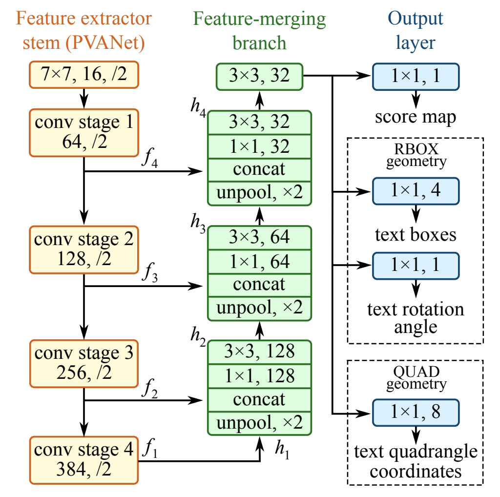

# EAST_OCR_webcam
## 目录
- [介绍](#介绍)
- [安装](#安装)
- [EAST 模型](#EAST)
- [下载](#下载)
- [使用](#使用)
- [引用](#引用)
## 介绍
Demo 可以实现在摄像头上实时检测文本框并进行文字识别。
## 安装
Python 3.6  
OpenCV 3.4.2  
Tesseract  
imutils
## EAST 模型

## 下载
[EAST 模型](https://raw.githubusercontent.com/oyyd/frozen_east_text_detection.pb/master/frozen_east_text_detection.pb)
## 使用
运行 [`EAST_OCR.ipynb`](./EAST_OCR.ipynb)
## 引用
- [EAST: An Efficient and Accurate Scene Text Detector](https://arxiv.org/abs/1704.03155v2)
- [OpenCV Text Detection](https://www.pyimagesearch.com/2018/08/20/opencv-text-detection-east-text-detector/)
